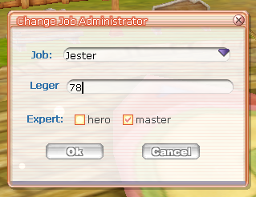

# Flyff-Systems

Regroupement des systemes realiser en live avec le chat !  
Venez proposer vos idee [ici](https://discord.gg/fZP7TWq).  
Suivez le live [ici](https://www.twitch.tv/s4oul/).  

 Ce projet n'est pas affilié avec ***Gala Lab***  

##  License
Le code source et l'application elle-même sont destinés à être utilisés en fonction de la pièce jointe. 
[license](./LICENSE.md). 

# Utils
Vous trouverez un ensemble de fonction ou fixe necessaire pour utiliser les systemes presents. 

# Systêmes
Tous les systêmes réalisé ont été fait via `Visual Studio 2019`. 
La version minimun de C++ >= `11`, la version `14` est recommandée. 
La version de ***Fly For Fun*** est la ***V15***. 

## AwakeCustom
Idea by Zeepone. 
`Awake Custom` permet d'eveille vos armes automatiquement.

## Item Count
Idea by ForEach. 
`ItemCount` permet de voir combien d'item de ce même ID y a-t-il en jeu.

## Calendar
Idea by Zeepone. 
`Calendar` recuperation de bonus quotidien. 

## Shop Favored
Idea by ForEach. 
`ShopFavored` permet de suivre une boutique. Indiquateur visuel.

## Admin Change Level
`Admin Change Level` permet de changer de niveau et de job via une interface. 
Le system s'appuie sur la commande `/level`. 

## Choix de la difficulte dans les donjon
`DifficultyInstance` permet de choisir une difficulte dans les donjons. 
 La premier version presente de nombreux bugs ! . 

# TowerGuild
Realisation d'un defie pour les guildes. 
Le principe est de finir passer les etages afin de recuperer des recompenses. 
Les etages sont configurer un/des fichiers de configuration. 
Les joueurs utilisent les commandes `entertg` ou `etg` afin de rentrer dans la TowerGuild. 
Les joueurs utilisent les commandes `quittg` ou `qtg` afin de sortir dans la TowerGuild. 

