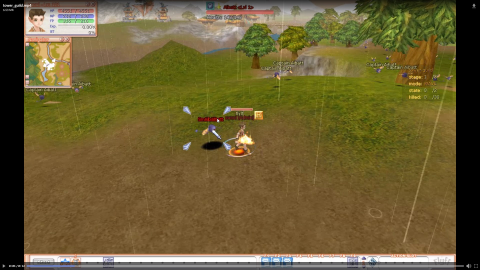

# Introduction

Si vous lisez ce fichier au format `MD` utiliser le site web [dilliger](https://dillinger.io/) pour avoir la mise en page.<br>
Systeme réalisé dans le cadre d'une session de [live](https://www.twitch.tv/s4oul/).<br>
L'idee du systeme revient a Zeepone !<br>
Vous avez des idées et vous souhaitez la voir réaliser venez la proposer sur le discord [AstralStudio](https://discord.gg/fZP7TWq).<br>

# TowerGuild
Realisation d'un defie pour les guildes.<br>
Le principe est de finir passer les etages afin de recuperer des recompenses.<br>
Les etages sont configurer un/des fichiers de configuration.<br>
Les joueurs utilisent les commandes `entertg` ou `etg` afin de rentrer dans la TowerGuild.<br>
Les joueurs utilisent les commandes `quittg` ou `qtg` afin de sortir dans la TowerGuild.<br>


# Amelioration
Affichage des recompenses.<br>
Interface rentrer/sortir au lieu des commandes.<br>

# Integration
Vous devez placer les fichier `TowerGuild.h` et `TowerGuild.cpp` dans `_Common_` puis ajouter les a votre solution `Neuz` et `WorldServer` via `VisualStudio`. <br>
Placer les dossier `towerguild` dans vos ressource/client. Les chemins sont configurables.<br>
Par defaut 3 etages sont configurer, les etages se passer dans `WI_WORLD_MADRIGAL` il est fortement conseil de creer de nouvelles maps !.<br>

# Sources

## VersinCommon
```cpp
#define			__TOWER_GUILD						//	Tour de guilde like SAO. Idea by  @Expresso
```

## MsgHdr.h
```cpp
#if defined(__TOWER_GUILD)
#define 	PACKETTYPE_TG_ENTER                     (DWORD)0x98100606
#define 	PACKETTYPE_TG_QUIT                      (DWORD)0x98100607
#define 	PACKETTYPE_TG_SAVE                      (DWORD)0x98100608
#endif //#if defined(__TOWER_GUILD)
```
```cpp
#if defined(__TOWER_GUILD)
#define SNAPSHOTTYPE_TOWER_GUILD_STAGE_STATE        (WORD)0x8905
#define SNAPSHOTTYPE_TOWER_GUILD_MOMSTER_KILLED     (WORD)0x8906
#define SNAPSHOTTYPE_TOWER_GUILD_FINISH_STAGE       (WORD)0x8907
#endif //#if defined(__TOWER_GUILD)
```

## FuncTextCmd.cpp
```cpp
#if defined(__TOWER_GUILD) && defined(__WORLDSERVER)
#include "TowerGuild.hpp"
#endif //#if defined(__TOWER_GUILD)
```
```cpp
#if defined(__TOWER_GUILD)
	ON_TEXTCMDFUNC(TextCmd_EnterTG, "entertg", "etg", "entertg", "etg", TCM_SERVER, AUTH_ADMINISTRATOR, "rentrer dans la TowerGuild")
	ON_TEXTCMDFUNC(TextCmd_QuitTG, "quittg", "qtg", "entertg", "qtg", TCM_SERVER, AUTH_ADMINISTRATOR, "quitter dans la TowerGuild")
#endif //#if defined(__TOWER_GUILD)
```
```cpp
#if defined(__TOWER_GUILD)
BOOL TextCmd_EnterTG(CScanner& s)
{
#if defined(__WORLDSERVER)
	CUser* pUser = (CUser*)s.dwValue;
	CTowerGuild::Instance().Enter(pUser);
#endif
	return TRUE;
}

BOOL TextCmd_QuitTG(CScanner& s)
{
#if defined(__WORLDSERVER)
	CUser* pUser = (CUser*)s.dwValue;
	CTowerGuild::Instance().Quit(pUser);
#endif
	return TRUE;
}
#endif //#if defined(__TOWER_GUILD)
```

## Guild.h
***class CGuild***
```cpp
#if defined(__TOWER_GUILD)
	unsigned int	m_uTowerGuildStageId;
#endif //#if defined(__TOWER_GUILD)
```

## Guild.cpp
***CGuild::CGuild()***
```cpp
#if defined(__TOWER_GUILD)
	m_uTowerGuildStageId = 1;
#endif //#if defined(__TOWER_GUILD)
```
***void CGuild::Serialize( CAr & ar, BOOL bDesc )*** apres
```cpp
		ar << m_idGuild << m_idMaster << m_nLevel;
		ar.WriteString( m_szGuild );
```
ajouter
```cpp
#if defined(__TOWER_GUILD)
		ar << m_uTowerGuildStageId;
#endif //#if defined(__TOWER_GUILD)
```
apres
```cpp
		ar >> m_idGuild >> m_idMaster >> m_nLevel;
		ar.ReadString( m_szGuild, MAX_G_NAME );
```
ajouter
```cpp
#if defined(__TOWER_GUILD)
		ar >> m_uTowerGuildStageId;
#endif //#if defined(__TOWER_GUILD)
```

## Project.cpp (WorldServer et Client)
```cpp
#if defined(__TOWER_GUILD)
#include "TowerGuild.hpp"
#endif //#if defined(__TOWER_GUILD)
```
***BOOL CProject::OpenProject()***
```cpp
#if defined(__TOWER_GUILD)
#if defined(__WORLDSERVER) || defined(__CLIENT)
    if (CTowerGuild::Instance().Load() == false)
    {
        OUTPUTDEBUGSTRING("%s ==> Fail load tower guil", __FUNCTION__);
        Error("Fail load tower guil");
        return FALSE;
    }
#endif //__WORLDSERVER
#endif //#if defined(__TOWER_GUILD)
```

## DbManager.cpp
```cpp
#if defined(__TOWER_GUILD)
void CDbManager::GuildSaveIdStageTowerGuild(CQuery* pQuery, CQuery* pQueryLog, LPDB_OVERLAPPED_PLUS lpDbOverlappedPlus)
{
	CAr ar(lpDbOverlappedPlus->lpBuf, lpDbOverlappedPlus->uBufSize);

	unsigned int	uIdGuild;
	unsigned int	uStageId;
	ar >> uIdGuild;
	ar >> uStageId;

	CString szQuery;
	szQuery.Format("UPDATE GUILD_TBL SET uTowerGuildId='%u' WHERE m_idGuild='%06d' AND serverindex='%02d'",
		uStageId,
		uIdGuild,
		g_appInfo.dwSys);

	if (!pQuery->Exec(szQuery))
		Error("%s ==> ERROR SQL[%s]", __FUNCTION__, szQuery.GetBuffer());
}
#endif //#if defined(__TOWER_GUILD)
```
***void CDbManager::OpenGuild(void)***
avant 
```cpp
		g_GuildMng.AddGuild( pGuild );
```
ajouter
```cpp
#if defined(__TOWER_GUILD)
		pGuild->m_uTowerGuildStageId = pQuery->GetBigInt("uTowerGuildId");
		if (pGuild->m_uTowerGuildStageId == 0)
			pGuild->m_uTowerGuildStageId = 1;
#endif //#if defined(__TOWER_GUILD)
```
***void CDbManager::GuildThread(void)***
```cpp
#if defined(__TOWER_GUILD)
			case TOG_SAVE:
				GuildSaveIdStageTowerGuild(pQuery, pQueryLog, lpDbOverlappedPlus);
				break;
#endif //#if defined(__TOWER_GUILD)
```

## DbManager.h
***enum QUERYMODE***
```cpp
#if defined(__TOWER_GUILD)
	TOG_SAVE,
#endif //#if defined(__TOWER_GUILD)
```
```cpp
#if defined(__TOWER_GUILD)
	void	GuildSaveIdStageTowerGuild(CQuery* pQuery, CQuery* pQueryLog, LPDB_OVERLAPPED_PLUS lpDbOverlappedPlus);
#endif //#if defined(__TOWER_GUILD)
```

## dptrans.cpp
```cpp
#if defined(__TOWER_GUILD)
	ON_MSG(PACKETTYPE_TG_SAVE, &CDPTrans::OnSaveIdStageTowerGuild);
#endif //#if defined(__TOWER_GUILD)
```
```cpp
#if defined(__TOWER_GUILD)
void CDPTrans::OnSaveIdStageTowerGuild(CAr& ar, DPID dpid, DPID dpidCache, DPID dpidUser, LPBYTE lpBuf, u_long uBufSize)
{
	LPDB_OVERLAPPED_PLUS lpDbOverlappedPlus = g_DbManager.AllocRequest();
	g_DbManager.MakeRequest(lpDbOverlappedPlus, lpBuf, uBufSize);
	lpDbOverlappedPlus->nQueryMode = TOG_SAVE;
	PostQueuedCompletionStatus(g_DbManager.m_hIOCPGuild, 1, NULL, &lpDbOverlappedPlus->Overlapped);
}
#endif //#if defined(__TOWER_GUILD)
```

## dptrans.h
```cpp
#if defined(__TOWER_GUILD)
	void	OnSaveIdStageTowerGuild(CAr& ar, DPID dpid, DPID dpidCache, DPID dpidUser, LPBYTE lpBuf, u_long uBufSize);
#endif //#if defined(__TOWER_GUILD)
```

## WndWorld.cpp
```cpp
#if defined(__TOWER_GUILD)
#include "TowerGuild.hpp"
#endif //#if defined(__TOWER_GUILD)
```
***BOOL CWndWorld::OnEraseBkgnd(C2DRender* p2DRender)***
avant 
```cpp
if (g_pPlayer && g_pPlayer->GetWorld() && g_pPlayer->GetWorld()->GetID() == WI_WORLD_GUILDWAR)
```
ajouter
```cpp
#if defined(__TOWER_GUILD)
	if (CTowerGuild::Instance().IsInside())
	{
		CPoint  cPoint = CPoint(GetClientRect().Width() - 150, 200);
		CRect crBoard{
			cPoint.x - 10,
			cPoint.y - 10,
			cPoint.x + 140,
			cPoint.y + 100
		};
		p2DRender->RenderFillRect(crBoard, D3DCOLOR_ARGB(30, 0, 0, 0));

		CPoint pt{cPoint.x, cPoint.y};
		pt.x += 10;
		p2DRender->TextOut(pt.x, pt.y, "tower guild", 0xFFEBAD18, 0xFF000000);

		pt.y += 20;
		p2DRender->TextOut(pt.x, pt.y, "stage:", 0xFFEBAD18, 0xFFFFFF99);
		p2DRender->TextOut(pt.x + 45, pt.y, std::to_string(CTowerGuild::Instance().uCurrentStageId).c_str(), 0xFFFFFF99, 0xFF000000);
		p2DRender->TextOut(pt.x + 45 + 25, pt.y, "/", 0xFFFFFF99, 0xFF000000);
		p2DRender->TextOut(pt.x + 45 + 30, pt.y, CTowerGuild::Instance().szCurrentMaxStage.c_str(), 0xFFFFFF99, 0xFF000000);

		pt.y += 20;
		p2DRender->TextOut(pt.x, pt.y, "mode:", 0xFFEBAD18, 0xFFFFFF99);
		if (CTowerGuild::Instance().uCurrentStateFlag == TWGuild::TGSatte::WAVE)
			p2DRender->TextOut(pt.x + 45, pt.y, "WAVE", 0xFFEBAD18, 0xFF000000);
		else if (CTowerGuild::Instance().uCurrentStateFlag == TWGuild::TGSatte::BOSS)
			p2DRender->TextOut(pt.x + 45, pt.y, "BOSS", 0xFFEBAD18, 0xFF000000);
		else if (CTowerGuild::Instance().uCurrentStateFlag == TWGuild::TGSatte::FINISH)
			p2DRender->TextOut(pt.x + 45, pt.y, "COMPLETED", 0xFFEBAD18, 0xFF000000);

		pt.y += 20;
		p2DRender->TextOut(pt.x, pt.y, "state:", 0xFFEBAD18, 0xFFFFFF99);
		p2DRender->TextOut(pt.x + 45, pt.y, std::to_string(CTowerGuild::Instance().uCurrentIndexStateId).c_str(), 0xFFFFFF99, 0xFF000000);
		p2DRender->TextOut(pt.x + 45 + 25, pt.y, "/", 0xFFFFFF99, 0xFF000000);
		p2DRender->TextOut(pt.x + 45 + 30, pt.y, CTowerGuild::Instance().szCurrentMaxState.c_str(), 0xFFFFFF99, 0xFF000000);

		pt.y += 20;
		p2DRender->TextOut(pt.x, pt.y, "killed:", 0xFFEBAD18, 0xFFFFFF99);
		p2DRender->TextOut(pt.x + 45, pt.y, std::to_string(CTowerGuild::Instance().uCurrentMonsterKilled).c_str(), 0xFFFFFF99, 0xFF000000);
		p2DRender->TextOut(pt.x + 45 + 25, pt.y, "/", 0xFFFFFF99, 0xFF000000);
		p2DRender->TextOut(pt.x + 45 + 30, pt.y, CTowerGuild::Instance().szCurrentMaxMonster.c_str(), 0xFFFFFF99, 0xFF000000);
	}
#endif //#if defined(__TOWER_GUILD)
```

## DPClient.cpp
```cpp
#if defined(__TOWER_GUILD)
			case SNAPSHOTTYPE_TOWER_GUILD_STAGE_STATE: OnStageStateTowerGuild(objid, ar); break;
			case SNAPSHOTTYPE_TOWER_GUILD_MOMSTER_KILLED: OnKilledMonsterTowerGuild(objid, ar); break;
			case SNAPSHOTTYPE_TOWER_GUILD_FINISH_STAGE: OnFinishStageTowerGuild(objid, ar); break;
#endif //#if defined(__TOWER_GUILD)
```

## DPClient.h
```cpp
#if defined(__TOWER_GUILD)
	void OnStageStateTowerGuild(OBJID objid, CAr& ar);
	void OnKilledMonsterTowerGuild(OBJID objid, CAr& ar);
	void OnFinishStageTowerGuild(OBJID objid, CAr& ar);
#endif //#if defined(__TOWER_GUILD)
```

## AttackArbiter.cpp
avant
```cpp	m_pAttacker->m_nAtkCnt = 0;
	m_pDefender->DoDie( m_pAttacker, m_dwMsg );
	m_pAttacker->ClearDestObj();
```
ajouter
```cpp
#if defined(__TOWER_GUILD)
	if (m_pAttacker->IsPlayer() && m_pDefender->IsNPC())
	{
		if (CTowerGuild::Instance().IsInTowerGuild(m_pAttacker) == true)
		{
			CTowerGuild::Instance().ProcessKillMonster(m_pAttacker, m_pDefender);
		}
	}
#endif //#if defined(__TOWER_GUILD)
```

## DPDatabaseClient.h
```cpp
#if defined(__TOWER_GUILD)
	void	SendGuildSaveTowerGuild(unsigned int uIdGuild, unsigned int uStageId);
#endif //#if defined(__TOWER_GUILD)
```

## DPSrvr.cpp
```cpp
#if defined(__TOWER_GUILD)
	ON_MSG(PACKETTYPE_TG_ENTER, &CDPSrvr::OnEnterTowerGuild);
	ON_MSG(PACKETTYPE_TG_QUIT, &CDPSrvr::OnQuitTowerGuild);
#endif //#if defined(__TOWER_GUILD)
```

## DPSrvr.h
```cpp
#if defined(__TOWER_GUILD)
    void    OnEnterTowerGuild(CAr& ar, DPID dpidCache, DPID dpidUser, LPBYTE, u_long);
    void    OnQuitTowerGuild(CAr& ar, DPID dpidCache, DPID dpidUser, LPBYTE, u_long);
#endif //#if defined(__TOWER_GUILD)
```

## User.h
```cpp
#if defined(__TOWER_GUILD)
#include "TowerGuild.hpp"
#endif //#if defined(__TOWER_GUILD)
```
```cpp
#if defined(__TOWER_GUILD)
    void    SendStageStateTowerGuild(unsigned int uStageID, unsigned int uStateID, unsigned short uStateFlag);
    void    SendMonsterKilledTowerGuild(TWGuild::TGSatte state, unsigned int uCountKilled);
    void    SendFinishStageTowerGuild(unsigned int uStageId);
#endif //#if defined(__TOWER_GUILD)
```